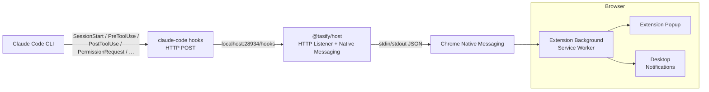

# Tasify

Real-time monitoring and permission management toolkit for [Claude Code](https://docs.anthropic.com/en/docs/claude-code/overview) hooks.

Tasify bridges Claude Code's hook system with a Chrome extension and a standalone dashboard, giving you live visibility into Claude's actions — task events, permission requests, state changes — all surfaced through desktop notifications and a rich UI.

## Architecture Overview



In addition to the extension path, the standalone dashboard (`frontend/`) connects to a WebSocket endpoint (mock server or real adapter) for a richer event terminal, task detail views, and metrics visualization.

## Quick Start

### 1. Install @tasify/host

```bash
npm install -g @tasify/host
```

The `postinstall` script runs automatically and:

- Writes the Native Messaging host manifest to `com.tasify.claude.host.json`
- Registers the host in the Windows Registry under `HKCU\Software\Google\Chrome\NativeMessagingHosts\com.tasify.claude.host`
- Injects hook configurations into your Claude Code settings (`~/.claude/settings.json`) and Lang CLI settings (`~/.langcli/settings.json`)

> **Prerequisites:** Windows (only supported platform), Google Chrome or any Chromium-based browser, Node.js 18+.

### 2. Install the Chrome Extension

1. Build the extension from source (see [Building & Packaging](#building--packaging)) or load the unpacked build.
2. Open `chrome://extensions`, enable **Developer mode**, and click **Load unpacked**.
3. Point it to the `extension/` directory (or the unpacked output directory after `npx wxt build`).
4. You should see the Tasify extension card. The background service worker connects to the Native Messaging host automatically.

### 3. Open the Extension Popup

Click the Tasify extension icon in the toolbar. Chrome launches the host automatically
via Native Messaging when the extension connects. No manual `tasify-host` command is needed.

The popup should show **Connected**.


## Usage Guide

### Running the Host (Debug Only)

Chrome launches the host automatically when the extension connects. Manual startup is
only needed for debugging or testing the host in isolation.

```bash
tasify-host
```

To run with structured logging:

```bash
LOG_LEVEL=debug tasify-host
```

The host exposes:

The host exposes:

| Endpoint             | Description                                      |
|----------------------|--------------------------------------------------|
| `GET /api/health`    | Health check (status, uptime)                    |
| `POST /hooks`        | Hook callback receiver — accepts any Claude Code hook event |

### Extension Popup

The popup is the primary interface for live monitoring. It shows:

- **Status indicator** — connection state (Connected / Disconnected / Host Not Found)
- **Event terminal** — a scrollable, real-time log of Claude Code hooks, errors, and results
- **Control buttons** — connect / disconnect host, view pending permission requests

The popup communicates with the background service worker via `chrome.runtime.connect` (port name `popup-background`). The service worker manages:

- Native Messaging Port lifecycle with auto-reconnect (3s delay)
- Desktop notifications for configurable event types
- Permission request queue with approve/deny buttons in notifications

### Permission Approval Flow

1. Claude Code sends a `PermissionRequest` hook (e.g., before executing a Bash command).
2. The host forwards it to the extension via Native Messaging.
3. The extension's background worker queues the request and shows a desktop notification.
4. Clicking **Approve** or **Deny** on the notification (or resolving it from the popup) sends a `PERMISSION_DECISION` back through the host to Claude Code's hook endpoint.
5. Requests that time out (default 24h) are auto-denied.

### Notification Preferences

Open the extension's **Options** page (right-click the extension icon → **Options**) to toggle desktop notifications per event type:

| Event                | Default |
|----------------------|---------|
| `SessionStart`       | Off     |
| `UserPromptSubmit`   | Off     |
| `PreToolUse`         | On      |
| `PostToolUse`        | On      |
| `PermissionRequest`  | On      |
| `Stop`               | Off     |
| `SessionEnd`         | Off     |
| `CLAUDE_ERROR`       | On      |
| `STATUS_CHANGE`      | On      |

### Dashboard (Standalone)

The `frontend/` directory contains a standalone web dashboard built with React + Vite + Socket.io. It provides:

- **Task Detail Card** — current task name and status
- **Control Panel** — stop task, sync state, trigger mock hooks
- **Data Visualization** — event severity breakdown (Chart.js pie chart)
- **Event Terminal** — color-coded, auto-scrolling event feed

To run it:

```bash
cd frontend
npm install
npm run dev
```

The dashboard connects to a WebSocket server at `http://localhost:3001` by default. A mock server is available at `server/`:

```bash
cd server
npm install
npm start
```

The mock server emits synthetic Claude Code events every 3 seconds for development and demonstration.

## Development

### Repository Structure

```
Tasify/
├── host/                   # @tasify/host — Native Messaging Host
│   ├── src/
│   │   ├── index.js           # Entry point
│   │   ├── config.js          # Environment-based configuration
│   │   ├── stdio-bridge.js    # Chrome Native Messaging protocol
│   │   ├── http-listener.js   # Express hook receiver
│   │   ├── shell-executor.js  # claude-code CLI spawner
│   │   ├── logger.js          # Structured logger (stderr)
│   │   └── utils/
│   │       └── buffer-helper.js  # Native Messaging buffer encode/decode
│   └── scripts/
│       ├── postinstall.js     # Auto-registration on npm install
│       ├── uninstall.js       # Cleanup on npm uninstall
│       ├── run-host.js        # CLI entry point
│       ├── run-host.bat       # Batch launcher for Native Messaging manifest
│       ├── install-host.ps1   # Manual registry setup
│       └── uninstall-host.ps1 # Manual registry cleanup
├── extension/              # Chrome Extension (WXT + React + TypeScript)
│   ├── entrypoints/
│   │   ├── background.ts      # Service Worker (Native Messaging, notifications, permissions)
│   │   ├── popup/             # Popup UI
│   │   │   ├── App.tsx
│   │   │   ├── components/
│   │   │   ├── services/
│   │   │   └── store/
│   │   └── options/           # Options page (notification prefs)
│   └── wxt.config.ts
├── frontend/               # Standalone Dashboard (React + Vite)
│   ├── src/
│   │   ├── App.jsx
│   │   ├── components/       # StatusIndicator, EventTerminal, ControlPanel, etc.
│   │   ├── services/         # ClaudeService + WebSocketTransport
│   │   ├── store/            # Zustand state management
│   │   └── hooks/
│   └── vite.config.js
└── server/                 # Mock Server (Express + Socket.io)
    └── index.js
```

### Local Development Commands

```bash
# Host — run directly from source
cd host
npm install
npm start

# Extension — dev mode with hot reload
cd extension
npm install
npm run dev

# Frontend Dashboard
cd frontend
npm install
npm run dev

# Mock Server
cd server
npm install
npm start
```

### Hook Event Types

Claude Code can be configured to fire HTTP hooks at various lifecycle points. Tasify hooks into these events (configured automatically during `postinstall`):

| Event              | When it fires                              | Timeout |
|--------------------|--------------------------------------------|---------|
| `SessionStart`     | A new Claude Code session begins           | 10s     |
| `UserPromptSubmit` | User submits a prompt                      | 30s     |
| `PreToolUse`       | Before executing a tool (Bash, Edit, etc.) | 10s     |
| `PostToolUse`      | After a tool completes                     | 10s     |
| `PermissionRequest`| Claude requests approval to run Bash       | 86400s  |
| `Stop`             | Session is stopped                         | 10s     |
| `SessionEnd`       | Session ends                               | 5s      |

Each hook fires an HTTP POST to `http://localhost:28934/hooks` with the event payload. The host forwards it through Native Messaging to the extension.

### Building & Packaging

```bash
# Build the extension for distribution
cd extension
npm run build     # WXT production build into .output/
npm run zip       # Create a .zip for Chrome Web Store upload
```

To install the extension from a local build, load the unpacked `.output/` directory from `chrome://extensions`.

The `@tasify/host` package is published to npm. To publish an update:

```bash
cd host
npm version patch   # or minor / major
npm publish
```

## FAQ

**Q: What platforms are supported?**
Currently **Windows**, **macOS** (Intel + Apple Silicon), and **Linux**.
The Native Messaging manifest and registration steps are handled automatically
for each OS during `npm install -g @tasify/host`.
**Q: The extension shows "Host Not Found".**

Make sure `@tasify/host` is installed globally and the `postinstall` script ran successfully. You can verify the registry key:

```
HKCU\Software\Google\Chrome\NativeMessagingHosts\com.tasify.claude.host
```

If missing, run `scripts/install-host.ps1` from an elevated PowerShell.

**Q: How do I change the hooks port?**

Set `TASIFY_PORT` before starting the host:

```bash
set TASIFY_PORT=28935 && tasify-host
```

Then update `~/.claude/settings.json` to match.

**Q: Can I use a shared secret for hook verification?**

Yes. Set `TASIFY_HOOK_TOKEN` to a secret value. The host will reject POSTs without a matching `Authorization: Bearer <token>` or `X-Hook-Token` header.

**Q: Claude Code is not firing hooks.**

Check that `~/.claude/settings.json` contains the `hooks` block (it should be added automatically during `postinstall`). You can also run:

```bash
npx @tasify/host
```

and watch for `[tasify] hook received` in the output to confirm hook delivery.

